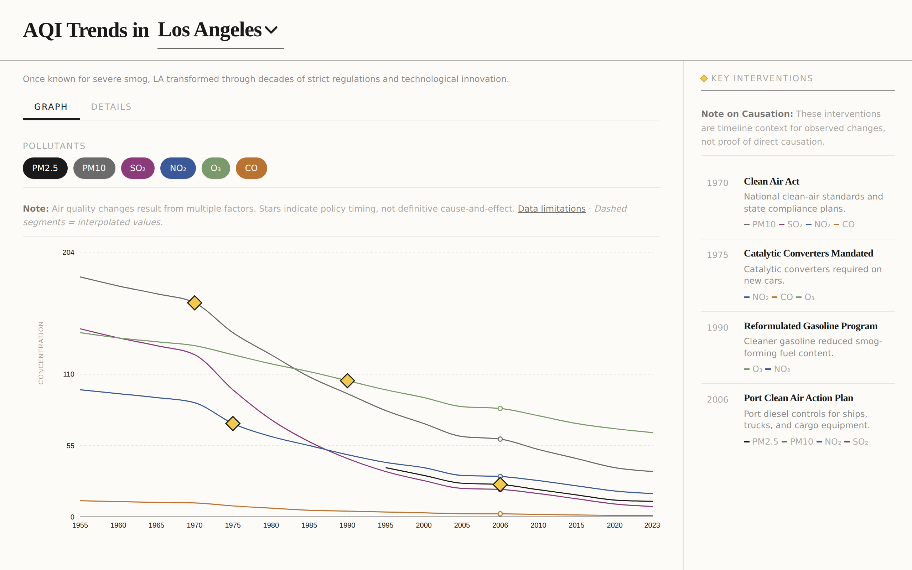

# AQI Improvement Tracker

[](./LICENSE)
[](https://react.dev/)
[](https://vitejs.dev/)
[](https://tailwindcss.com/)
[](https://github.com/rakshran/aqi-tracker/actions/workflows/ci.yml)

An interactive data visualization showing how major cities around the world have battled air pollution and the key interventions that led to significant improvements.

**🔗 Live demo: [aqi.rakshitranjan.com](https://aqi.rakshitranjan.com)**

## Preview

<!-- Add a screenshot at docs/images/preview.png and it will render below. -->
<!-- Tip: capture the live site or run `npm run dev`, then drop the image at that path. -->



## Features

- 📊 **Interactive temporal charts** showing decades of air quality data
- 🏙️ **8 major cities** with detailed historical data (Los Angeles, Beijing, London, Mexico City, Delhi, Tokyo, Seoul, Pittsburgh)
- 📍 **Key milestone markers** highlighting major policy interventions with clickable stars
- 📈 **Progress metrics** showing improvements over time
- 🎨 **Our World in Data inspired design** - clean, accessible, and data-focused
- 🔍 **Data transparency** - interpolated data points clearly marked and labeled

## Cities Covered

This project examines air quality trends in **8 major cities** across North America, Europe, and Asia:

- **Los Angeles, USA** - From severe smog capital to cleaner air through decades of regulation
- **London, UK** - Pioneering clean air legislation after the Great Smog of 1952
- **Beijing, China** - Dramatic improvement through aggressive interventions (2013-present)
- **Mexico City, Mexico** - Innovative programs like Hoy No Circula
- **Tokyo, Japan** - Post-war transformation with industrial emission controls
- **Seoul, South Korea** - Public transport expansion and emission standards
- **Pittsburgh, USA** - Steel city transformation through smoke control
- **Delhi, India** - Ongoing efforts to combat severe pollution challenges

### Why These Cities?

**Important Context on City Selection:**

This project focuses on cities with **documented improvements or significant policy interventions**. This selection approach has inherent limitations:

- **Selection Bias**: Cities shown experienced measurable air quality improvements or implemented major interventions. Cities where pollution worsened or remained stagnant are not represented.
- **Geographic Gaps**: No cities from Africa, South America, Central Asia, or Oceania are included due to limited availability of long-term historical data.
- **Success-Oriented Narrative**: The dataset emphasizes cases where policy actions were followed by measurable changes, which may create an overly optimistic view of policy effectiveness.
- **Data Availability**: City selection was constrained by the availability of reliable, long-term monitoring data (20+ years) from government sources.

**What's Missing:**
- Cities where air quality worsened despite interventions
- Cities with deteriorating air quality and no major policy response
- Regions with limited historical air quality monitoring infrastructure
- Cities that improved but later regressed

For a more balanced understanding of global air quality trends, consult comprehensive databases like [Our World in Data](https://ourworldindata.org/air-pollution) and [WHO Air Quality Database](https://www.who.int/data/gho/data/themes/air-pollution).

## Key Interventions Highlighted

Each city's timeline shows major policy milestones:
- Clean air legislation and emission standards
- Vehicle restrictions and public transport improvements
- Industrial regulations and fuel standards
- Urban planning and infrastructure changes

## Technology Stack

Built following modern best practices:

- **React 18** - UI framework with hooks
- **Vite** - Fast build tool and dev server
- **Tailwind CSS** - Utility-first styling with default spacing/shadows
- **Recharts** - Declarative charting library for data visualization

## Design Principles

Follows modern interface design practices:
- ✅ Tailwind CSS defaults for spacing, radius, and shadows
- ✅ Accessible component interactions with ARIA labels
- ✅ Keyboard navigation support for all interactive elements
- ✅ Tabular numbers for data display
- ✅ Color-coded pollutants with consistent visual hierarchy
- ✅ Transparent data practices with clear interpolation indicators

## Getting Started

### Prerequisites
- Node.js 18+ and npm

### Installation

```bash
# Install dependencies
npm install

# Start development server
npm run dev

# Build for production
npm run build

# Preview production build
npm run preview
```

### Scripts

| Script | Description |
|--------|-------------|
| `npm run dev` | Start the Vite dev server |
| `npm run build` | Build the production bundle to `dist/` |
| `npm run preview` | Preview the production build locally |
| `npm run lint` | Run ESLint over the codebase |
| `npm run format` | Format files with Prettier |
| `npm run format:check` | Check formatting without writing changes |

## Deployment

This project is ready to deploy to any static hosting platform:

### Vercel (Recommended)
1. Push to GitHub
2. Import project in Vercel
3. Deploy automatically (configuration included in `vercel.json`)

### Netlify
1. Push to GitHub
2. Connect repository in Netlify
3. Use included `netlify.toml` configuration
4. Deploy automatically

### Other Platforms
Build the project with `npm run build` and deploy the `dist` folder to:
- GitHub Pages
- Cloudflare Pages
- AWS S3 + CloudFront
- Any static hosting service

## Data Sources

Historical air quality data compiled from multiple sources including:
- Government environmental agencies (EPA, Ministry of Environment agencies)
- WHO air quality database
- Academic research papers
- Our World in Data
- City-specific environmental reports

### Data Transparency

- **Measurements**: Pollutant concentrations represent approximate annual averages based on available monitoring data
- **Units**: PM2.5, PM10, SO2, NO2, O3 in µg/m³; CO in mg/m³
- **Interpolated Values**: Some data points for intervention years were interpolated from surrounding years when exact measurements were unavailable. These are clearly marked in the visualization with:
  - Hollow circle markers on chart lines
  - "Estimated" badges in tooltips
  - Data transparency notice above charts

📖 **For detailed methodology, data quality indicators, and verification guidance, see [docs/DATA_METHODOLOGY.md](./docs/DATA_METHODOLOGY.md) and [docs/DATA_SOURCES_AND_VERIFICATION.md](./docs/DATA_SOURCES_AND_VERIFICATION.md)**

## Project Structure

```
aqi-tracker/
├── .github/
│   ├── ISSUE_TEMPLATE/                # Bug report & feature request templates
│   ├── workflows/ci.yml              # Lint + build CI pipeline
│   └── PULL_REQUEST_TEMPLATE.md
├── docs/
│   ├── DATA_METHODOLOGY.md           # Measurement & interpolation methodology
│   └── DATA_SOURCES_AND_VERIFICATION.md  # Source attribution & verification
├── public/
│   └── favicon.svg                   # App icon
├── src/
│   ├── components/
│   │   ├── AboutDataModal.jsx        # Data methodology modal
│   │   ├── AboutSelectionModal.jsx   # Selection bias modal
│   │   ├── CitySelector.jsx          # Custom city select dropdown
│   │   ├── InterventionsPanel.jsx    # Sidebar intervention cards
│   │   ├── PollutionChart.jsx        # Recharts chart, toggles, tooltip
│   │   └── Sources.jsx               # Data sources display
│   ├── data/
│   │   └── citiesData.js             # Historical data and interventions
│   ├── utils/
│   │   └── cn.js                     # Class name utility (clsx + tailwind-merge)
│   ├── App.jsx                       # Main application layout
│   ├── main.jsx                      # Entry point
│   └── index.css                     # Tailwind directives and global styles
├── index.html                         # HTML template
├── eslint.config.js                   # ESLint flat config
├── .prettierrc                        # Prettier config
├── tailwind.config.js                 # Tailwind theme customization
├── vite.config.js                     # Vite build configuration
└── package.json                       # Dependencies and scripts
```

## Known Limitations

- **Screen reader support**: Chart data visualization has limited accessibility for screen readers; text alternatives being developed
- **Data coverage**: Historical data availability varies by city and time period
- **Causation complexity**: While interventions are marked at specific years, air quality improvements result from multiple overlapping factors

## Contributing

Contributions welcome! See [CONTRIBUTING.md](./CONTRIBUTING.md) for development setup and guidelines. Priority areas:
- Adding more cities with documented interventions
- Improving data accuracy with cited sources
- Improving accessibility features (screen reader support, reduced motion preferences)
- Adding automated tests

## License

This project is licensed under the [MIT License](./LICENSE).

## Inspiration

Design and approach inspired by [Our World in Data](https://ourworldindata.org/), the gold standard for data visualization and storytelling.

---

Built to show that dramatic air quality improvements are possible with sustained commitment and effective policy interventions.
